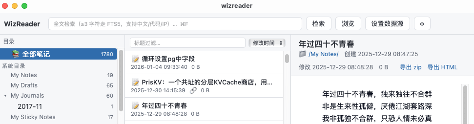

# WizReader

本人是为知笔记（WizNote 经典版）的老用户。WizReader 最初是存量数据的**本地只读阅读器**，v1.5 起成为一个**双向的私有笔记库 + 主从云同步**工具。

当云笔记订阅到期或停止服务时，你的数据不该被锁死——WizReader 以零风险的方式（绝不写入源数据）把存量笔记变成一个快速、可检索、可编辑、可同步、可导出的本地应用。**即使你从未导入过任何为知笔记，也能用它建立属于自己的笔记库。**



## v1.5 功能总结

**从「只读阅读器」到「可写、可同步的私有笔记库」**，本版新增：

- ✅ **主从式云同步**：主端（写入端）笔记上行 up 到云存储，从端（只读端）从云存储下行笔记
- ✅ **自建笔记库**：无需导入为知笔记，也能直接建立自己的笔记库并开始记录
- ✅ **写后自动同步**：编辑保存后自动上行，无需手动点按钮
- ✅ **冲突保护**：并发写入有版本护栏，冲突版本留档不丢失
- ✅ **回收站**：删除的笔记可恢复，30 天后自动清理
- ✅ **Markdown 源码编辑**：语法高亮 + 图片粘贴入包

## 功能特性

### 笔记库（v1.5 主线）

- **自建笔记库**：指定一个空目录为主数据目录，即可新建笔记/新建目录，**零为知数据起步**
- **两种形态共存**：
  - **笔记库模式**（主数据，可写）：Markdown 包存储，每篇一个 zip（`note.md` + `index_files/`），便于向 Obsidian 等工具迁移
  - **为知源模式**（一次性导入源，**永远只读**）
- **完整编辑能力**：Markdown 源码编辑器（语法高亮 + 编辑辅助）、笔记新建/改名/移动/删除、目录树新建目录与拖拽移动
- **图片与附件入包**：选图或直接粘贴截图，自动写进笔记包并插入正文；任意附件可插入正文
- **回收站**：删除先进回收站，可恢复、可按天数永久清理、30 天后自动 GC
- **自检工具**：全库巡检（10 项）与深度校验（逐篇 MD5），报告可导出为文件
- **派生索引**：存放在库目录之外，随时可重建；下行同步后增量更新，异常时自动全量重建

### 云同步（v1.5 主线）

- **主从角色**：一端「写入端（主端）」以本地库为准上行；另一端「只读端（从端）」以云端为准只下行，**从端禁写**（UI 禁用 + 后端护栏双重兜底）
- **三种触发时机**：启动时自动检查下行、设置页「一键同步」、**写后 4 秒防抖自动同步**
- **双向增量**：上行只传变更篇目，下行按水位差量拉取，附件随笔记整篇传输
- **并发护栏**：条件 PUT（`If-Match`）+ 版本落后拦截，冲突时回滚版本号，**绝不静默覆盖对方那一版**
- **冲突留档**：被淘汰的版本旁置到 `_conflicts/`，30 天后 GC，不丢数据
- **凭据安全**：access key / secret key 存入**macOS 钥匙串**，不落明文配置文件
- **兼容 S3 协议**：已在 Ceph 对象存储上完成真实三端闭环实测（另兼容 MinIO / AWS S3）

### 阅读与检索

- **三栏布局**：目录树（含笔记计数与排序）→ 笔记列表（按修改时间/创建时间/标题/大小排序）→ 阅读区
- **全文检索**：支持中文/代码/URL/IP 片段，附件文件名全量可检索；最近 20 条检索历史
- **附件管理**：四层归属策略（库内关联 / 文件名前缀 / 正文推断 / 未关联），逐一标注可信度来源，绝不自动猜测绑定；未关联附件集中视图 + 预览
- **代码块兼容层**：阅读与原版编辑器一样，不会出现乱行等问题
- **重复笔记识别**：正文 SHA-256 指纹分组，检索结果自动折叠同内容副本

### 导出与安全

- **导出逃生舱**：单篇导出为 zip 或自包含 HTML（图片/CSS 内联 data URI）；按目录整库导出还原文件树，未关联附件归入 `_unlinked_attachments/`，导出时支持清理未使用内容减少笔记体积
- **安全沙箱**：笔记 HTML 通过自定义 URI 协议流式读取（不落盘解压），响应头 CSP 沙箱隔离脚本与外链；远程图片默认禁用（防阅读行为泄漏），可在设置中开启
- **数据源自动探测**：自动定位 `~/.wiznote/<账号>/data`（macOS 隐藏目录，无需手工导航）

### 使用方法

#### 方式一：建立自己的笔记库（无需为知笔记）

1. 设置 → **主数据目录（笔记库）** → 选择一个空目录（例如 `~/Documents/我的笔记库`）；
2. 确认进入笔记库模式后，即可在空态页直接**新建笔记 / 新建目录**开始记录；
3. 库内主数据是 Markdown 包（每篇一个 zip），随时可整体拷走或迁往其他工具。

#### 方式二：导入为知笔记存量数据

1. 点击顶栏**「设置数据源」**，应用会自动探测为知默认数据目录（`~/.wiznote/<账号>/data`，须包含 `index.db` 与 `notes/`）；
2. 选中后自动重建派生索引（约 30 秒 / 2000 篇量级，13-inch MacBook Pro 2019 环境）；
3. 之后所有阅读与检索均基于本地派生索引，可随时重建；
4. 需要整理成自己的库时：**读取为知笔记 ▸ 导出 ▸ 导入到我的笔记库**（源数据始终只读，导出目录才是主数据）。

#### 如何缓存为知笔记到本地

在为知笔记中，点每个需要缓存的笔记，等这个笔记下载完，就缓存到你的电脑中了。

苹果电脑缓存位置：~/.wiznote

## 技术栈

| 层    | 技术                                              |
| ---- | ----------------------------------------------- |
| 桌面框架 | Tauri 2（Rust 核心 + 系统 WebView）                   |
| 前端   | Vue 3 + TypeScript + Vite                       |
| 存储   | rusqlite（SQLite，bundled）+ FTS5 trigram          |
| 数据访问 | 流式读取（LRU 句柄缓存 + 路径穿越防护）                         |
| 云同步  | rust-s3（S3 协议：AWS S3 / MinIO / Ceph）+ macOS 钥匙串 |

## 构建与运行

依赖：Rust（rustup）、Node.js ≥ 18、macOS（Windows 支持规划中）。

```bash
npm install            # 安装前端依赖

npm run tauri dev      # 开发模式（热重载）
npm run tauri build    # 构建发布版（.app / dmg）

# 或使用启动脚本
./wizreader.sh dev     # 开发模式
./wizreader.sh app     # 启动已构建的 release 应用
./wizreader.sh build universal          # 通用 .app（x86_64 + arm64）
./wizreader.sh build universal dmg      # 通用 .app + DMG
./wizreader.sh build                    # x86架构单架构 .app
```

### CLI 工具

```bash
# 索引与检索
wiz-cli build-index <data_dir> [--index-dir <dir>]     # 构建派生索引并输出校验报告
wiz-cli build-library-index <library_dir>              # 构建笔记库派生索引
wiz-cli search <kw> [--folder <path>]                  # 全文检索（≥3 字符走 FTS5 trigram）
wiz-cli peek <guid> [entry] [--data-dir <path>]       # 读取笔记 zip 内文件（调试用）
wiz-cli note-info <guid>                              # 单篇元信息

# 笔记库写入（CLI 库命令一律显式给 --library-dir）
wiz-cli create-note / rename-note / move-note / delete-note / restore-note
wiz-cli list-trash                                    # 查看回收站
wiz-cli trash-gc --before-days <n>                    # 清理过期回收站条目
wiz-cli save-note <guid> --file <md>                # 写入正文源码
wiz-cli manifest-rebuild                              # 重建清单

# 导出
wiz-cli export-note <guid> [--html <dest.html>]       # 单篇导出（默认 zip）
wiz-cli export-folder "<location>" <dest_dir>         # 按目录批量导出
wiz-cli export-all <dest_dir>                         # 全库按目录树导出
wiz-cli export-zips / build-md-library                # 按库形态导出

# 巡检与验收
wiz-cli verify [--export-all] [--json] [--out <file>] # 全库巡检
wiz-cli verify-library <library_dir> [--deep]         # 库校验（--deep 逐篇 MD5）
wiz-cli snapshot / snapshot-diff <a> <b>              # 源数据快照与比对
wiz-cli bench                                         # 性能基准

# 云同步
wiz-cli cloud-test                                    # 测试云端连通性
wiz-cli cloud-init                # 初始化云端同步（首推）
wiz-cli cloud-sync <up|down|none>                   # 手动触发同步
```

## 隐私与免责声明

- 本项目基于**为知笔记经典版**的本地存储格式实现。该格式已由社区长期公开分析与使用（各类导入导出教程与开源工具），本项目的表结构知识与代码实现均为独立完成；
- 本项目为**个人数据管理工具**，与为知笔记官方无关，亦未使用其任何非公开接口；
- 以只读方式访问为知笔记本地数据，**绝不修改、删除或上传源数据**；不带任何遥测；
- 云同步仅在你**显式配置**后才启用，凭据存于 macOS 钥匙串；同步内容为你自己的笔记库，不经过任何第三方服务器（直连你自己的 S3 兼容存储）。

## 现状与路线图

- [x] v0.1.0（macOS）：只读阅读 / 检索 / 附件 / 设置 / 导出
- [x] v1.0：笔记库模式——导入为知、库内新建/编辑/删除、回收站、全库巡检
- [x] v1.5：主从云同步（条件 PUT + 冲突留档 + 写后自动同步）、自建笔记库（无需导入）、Markdown 源码编辑器与图片入包、通用二进制构建

## License

MIT
